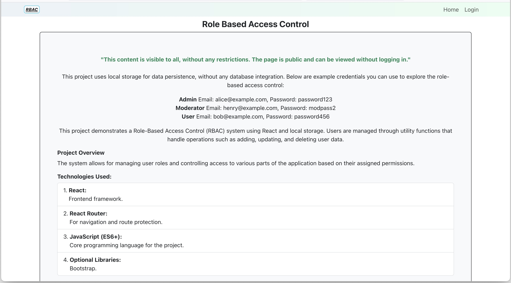

# Role-Based Access Control

## Overview

This project is a web application built with React and Vite that demonstrates role-based access control (RBAC). It allows users to have different levels of access based on their roles, such as user, moderator, and admin.

## Live Demo

Check out the live demo: [Role Based Access Control on Netlify](https://rolebasedaccesscontrol.netlify.app/)

## Features

- User authentication and authorization
- Role-based access control
- Dynamic content rendering based on user roles
- Responsive design

## Screenshots



## Installation

To run this project locally, follow these steps:

1. **Clone the repository:**

   ```bash
   git clone <repository-url>
   cd <repository-directory>
   ```

2. **Install dependencies:**

   ```bash
   npm install
   ```

3. **Run the development server:**

   ```bash
   npm run dev
   ```

4. **Open your browser:**

   Navigate to `http://localhost:3000` to see the application in action.

## Technologies Used

- **React:** A JavaScript library for building user interfaces.
- **Vite:** A fast build tool for modern web projects.
- **Netlify:** Hosting and continuous deployment.

## Contact

Feel free to reach out via [email](mailto:danutnanu@icloud.com) or [LinkedIn](https://www.linkedin.com/in/danut-nanu-7474b4267/).

